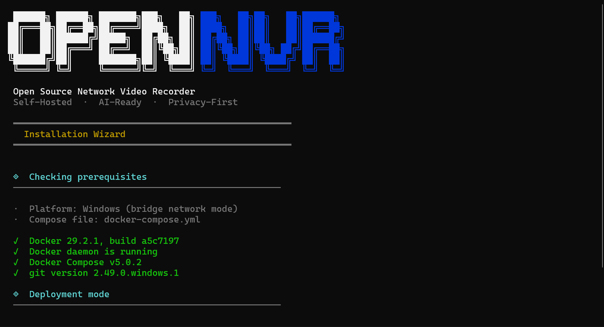
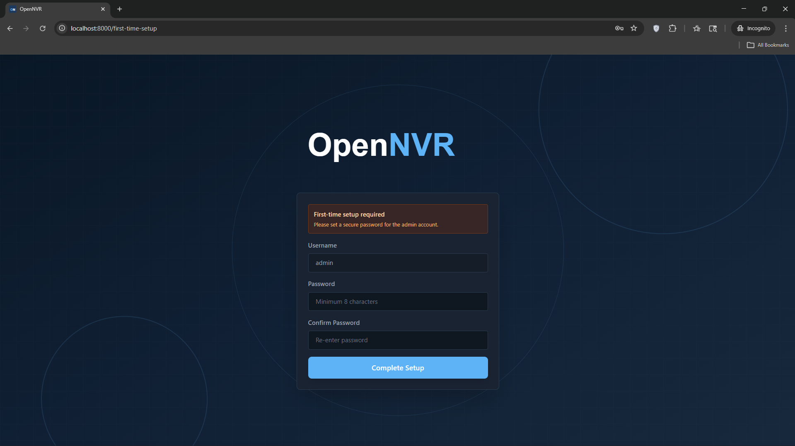

# 🛡️ OpenNVR
**AI-Powered, Security-First Video Surveillance Platform**

Bring AI to the Edge. Own Your Security. Deploy Anywhere.

## What you get

- **Live multi-camera NVR** — ONVIF / RTSP ingest, HLS playback, event recording via MediaMTX.
- **Pluggable AI pipeline** — person detection, face recognition, scene captioning out of the box; add your own via the [AI Adapter SDK](https://github.com/open-nvr/ai-adapter).
- **Self-hosted, privacy-first** — your footage never leaves your hardware unless *you* wire it up.
- **Secure-by-Design defaults** — no shipped default password, no placeholder secrets accepted, MediaMTX bound to loopback only, recording-path traversal refused. See [SECURITY_ARCHITECTURE.md](docs/SECURITY_ARCHITECTURE.md) for the offline-first design and its mapping to [Zenodo DOI 10.5281/zenodo.17261761](https://doi.org/10.5281/zenodo.17261761).
- **Cross-platform** — Windows, macOS, Linux (bridge or host networking).
- **One-command install** — interactive wizard generates secrets, clones optional components, and starts everything.

> **⚠️ Upgrading from a previous release?** This branch hardens the startup validator: symmetric secrets must be ≥ 32 characters, MediaMTX URLs must resolve to loopback (or set `ALLOW_REMOTE_MEDIAMTX=true`), and the admin account is now activated via a one-time token printed to stdout on first boot rather than a shipped default password. See the *Upgrading* section below for a quick checklist.

---

## 🐳 1. Docker Build & Deployment (Recommended)
This is the recommended approach for **Linux**, **macOS**, and **Windows** users. The install wizard wires the entire ecosystem together automatically.

### Prerequisites
- Git
- Docker Desktop (Windows/macOS) or Docker Engine + Compose v2 (Linux)

### Step-by-Step Build

1. **Clone the core OpenNVR repository**
   ```bash
   git clone https://github.com/open-nvr/open-nvr.git
   ```
   

2. **Clone the AI Adapter repository as a sibling**
   ```bash
   git clone https://github.com/open-nvr/ai-adapter.git
   ```
   

3. **Enter the NVR root directory**
   ```bash
   cd open-nvr
   ```
   

4. **Run the smart start script**

   **Linux / macOS:**
   ```bash
   chmod +x start.sh
   ./start.sh
   ```

   **Windows (PowerShell):**
   ```powershell
   .\start.ps1
   ```
   

   > **Initial Setup:** If it is your first time bringing the containers up, the interactive setup will block the sequence and engage with you in the terminal.

   

   On first run the wizard will:
   - check prerequisites (Docker, Compose, Git)
   - ask for recording storage path and initialization configs
   - check if the [ai-adapter](https://github.com/open-nvr/ai-adapter) repo is present
   - generate strong secrets and write `.env`
   - build images and start the stack

   The bundled `mediamtx-certs-init` service in `docker-compose.yml` automatically generates a self-signed TLS cert pair for MediaMTX (RTSPS / HLS-over-HTTPS / WebRTC signaling per V-019) on first boot if none exists. The pair lives under `./mediamtx-certs/` on the host. If you want a different SAN (e.g. routable hostname or LAN IP), run `./scripts/generate-mediamtx-certs.sh` once with `EXTRA_SAN="DNS:opennvr.lan,IP:10.0.0.5"` *before* the first `docker compose up`; subsequent runs skip generation when the files already exist.

   Subsequent runs of `start.sh` / `start.ps1` just validate and start — no re-install.

   > Prefer doing it by hand? Copy `.env.example` → `.env`, fill in secrets (or run `./scripts/generate-secrets.sh -Write` / `.\scripts\generate-secrets.ps1 -Write`), then `docker compose up -d --build`.

## 🌐 2. Access the Web UI

Once the services are healthy, open your browser and navigate to `http://localhost:8000`. You will automatically be redirected to the **First-Time Setup** page to initialize your `admin` password securely before accessing the dashboard.

### Activating the admin account on first boot

To close the bootstrap-race window (an attacker on the management LAN racing the operator to claim the admin account), `/auth/first-time-setup` is now gated by a **one-time setup token** that is generated on server startup whenever an admin user exists with `password_set=False`.

The token is printed to the server's stdout exactly once, inside a clearly delimited banner:

```
================================================================
 OpenNVR first-time setup token (one-time use)
----------------------------------------------------------------
  <copy this opaque string verbatim>
----------------------------------------------------------------
 Pass this token in the `setup_token` field of
 POST /auth/first-time-setup. It is consumed on first
 successful use. Restart the server to mint a new one.
================================================================
```

- **Docker users:** run `docker compose logs server | grep -A 6 "first-time setup token"` to retrieve it.
- **Local dev:** the token will print in the terminal that runs `python start.py`.
- **Missed it?** Restart the server — a new token is minted on every boot while a pending user exists.

Paste the token into the **First-Time Setup** form alongside your new admin password. After successful setup the token is consumed and cannot be reused.



🎉 **Core Endpoints:**
- OpenNVR Web UI: `http://localhost:8000`
- OpenNVR API Docs: `http://localhost:8000/docs`
- MediaMTX: `http://localhost:8889`
- AI Adapter API (if enabled): `http://localhost:9100`

---

## 💻 2. Local Developer Setup (Without Docker)
For developers looking to run OpenNVR purely locally in an IDE utilizing local virtual environments.

### Prerequisites
- **Python 3.11+**
- **uv** (Python package manager - [install guide](https://docs.astral.sh/uv/getting-started/installation/))
- **Node.js 18+**
- **PostgreSQL 13+** (Running locally on your OS)
- **MediaMTX** (Download the binary for your OS from their GitHub releases)

### Preparation
1. **Clone Both Repositories side-by-side**
   ```bash
   git clone https://github.com/open-nvr/open-nvr.git
   git clone https://github.com/open-nvr/ai-adapter.git
   ```
2. **Generate your environment file with strong secrets**
   ```bash
   cd open-nvr
   make secrets-env             # copies env.example -> server/.env and appends cryptographically random secrets
   # then edit server/.env to point DATABASE_URL at your local PostgreSQL
   make check-secrets           # confirms no placeholder values were left behind
   ```

   `make secrets-env` refuses to overwrite an existing `server/.env`, so it is safe to run on a fresh clone but will not silently rotate your keys.

   **Prefer doing it by hand?**
   ```bash
   cp server/env.example server/.env
   make secrets >> server/.env  # appends a generated `# --- generated by `make secrets` --- ` block
   # edit server/.env: set DATABASE_URL; leave DEFAULT_ADMIN_PASSWORD commented out unless you have a reason
   ```

   **What the startup validator now enforces** (fail-closed at boot):
   - `SECRET_KEY`, `MEDIAMTX_SECRET`, `INTERNAL_API_KEY` must be ≥ 32 characters and must not match any of the placeholder fragments shipped in `env.example` (`change-this-...`, `your-secret-...`, etc.).
   - `CREDENTIAL_ENCRYPTION_KEY` must be a valid 32-byte Fernet key and must not match placeholder fragments.
   - `MEDIAMTX_*_URL` values must resolve to a loopback address (`127.0.0.1`, `::1`, `localhost`). `0.0.0.0` is rejected because it is the wildcard bind, not loopback. Set `ALLOW_REMOTE_MEDIAMTX=true` only if you are intentionally fronting MediaMTX with a TLS-terminating reverse proxy on the management NIC.

### Running the Services (Requires 5 Terminals)
You must start the microservices independently.

**Terminal 1: PostgreSQL & OpenNVR Backend**
```bash
cd open-nvr/server
uv venv venv

# Activate venv (Linux: source venv/bin/activate | Windows: .\venv\Scripts\activate)
uv sync

# Migrate DB and Start
alembic upgrade head
python start.py
```

**Terminal 2: KAI-C (AI Orchestrator)**
```bash
cd open-nvr/kai-c
uv venv venv

# Activate venv (Linux: source venv/bin/activate | Windows: .\venv\Scripts\activate)
uv sync

# Start Connector
python start.py
```

**Terminal 3: React Frontend**
```bash
cd open-nvr/app
npm install
npm run dev
# Access frontend at http://localhost:5173
```

**Terminal 4: MediaMTX**
```bash
# Extract the binary you downloaded and run it using the local config file provided in our repo:
./mediamtx open-nvr/mediamtx.local.yml
```

**Terminal 5: AI Adapter (optional — only if you want AI detection)**
```bash
# Clone ai-adapter as a sibling directory to open-nvr:
#   parent/
#   ├── open-nvr/
#   └── ai-adapter/
git clone https://github.com/open-nvr/ai-adapter.git ../ai-adapter
cd ../ai-adapter
uv venv

# Activate venv (Linux/macOS: source .venv/bin/activate | Windows: .\.venv\Scripts\activate)
uv sync --extra all --extra cpu

# Download model weights
uv run python download_models.py

# Start Adapter
uv run uvicorn app.main:app --reload --port 9100
```

---

## ⬆️ Upgrading an existing deployment

If you are pulling this branch on top of an older OpenNVR `.env`, you may need three small changes before the server will boot:

1. **Rotate short secrets to ≥ 32 characters.** Run `make secrets` and paste the four generated values over the existing `SECRET_KEY`, `MEDIAMTX_SECRET`, `INTERNAL_API_KEY`, and `CREDENTIAL_ENCRYPTION_KEY` lines in your `server/.env`. If you rotate `CREDENTIAL_ENCRYPTION_KEY` you must also re-encrypt any stored camera credentials — `make secrets` does not do that for you.
2. **Confirm MediaMTX URLs are loopback.** `MEDIAMTX_BASE_URL`, `MEDIAMTX_ADMIN_API`, `MEDIAMTX_HLS_URL`, `MEDIAMTX_RTSP_URL`, and `MEDIAMTX_PLAYBACK_URL` must all resolve to `127.0.0.1` / `localhost` / `::1`. If you already had them pointed at a routable host on purpose, set `ALLOW_REMOTE_MEDIAMTX=true` to opt out of the check.
3. **Remove the old `DEFAULT_ADMIN_PASSWORD=admin123` line** from your `.env`. The admin account is now activated via the one-time setup token described above; see [SECURITY_ARCHITECTURE.md §2.1](docs/SECURITY_ARCHITECTURE.md). If you have automated deployment that *does* need to provision an initial password, leave `DEFAULT_ADMIN_PASSWORD=<your-strong-value>` set — the admin user will be created with `password_set=True` in that case and the setup-token flow is skipped.
4. **Decide your offline-first posture.** Two new settings now default to the strictest posture:
   - `DEPLOYMENT_MODE=offline` — every cloud-touching route returns 403. Use `hybrid` to opt back in to cloud streaming / cloud recording / cloud AI inference (each call is audit-logged), or `cloud` to disable all checks.
   - `AI_SOVEREIGNTY=local_only` — KAI-C refuses non-loopback adapter URLs and `/infer/cloud` returns 403. Set to `federated` or `cloud_allowed` if you have explicitly accepted the sovereignty trade-off. Important: **the same value must be set in KAI-C's environment** (it runs in its own process and reads the env var directly).
5. **(Re-check) MediaMTX URLs:** must be loopback unless `ALLOW_REMOTE_MEDIAMTX=true` is set.
6. **MediaMTX now requires TLS certs (V-019).** The hardened templates (`mediamtx.docker.yml`, `mediamtx.yml`) terminate TLS on the RTSPS, HLS, and WebRTC-signaling listeners. MediaMTX refuses to start without `server.crt` and `server.key`. Pick **one** of:

   **Option A — generate a self-signed cert pair (default path).**

   For Docker deployments this happens *automatically* on first `docker compose up` via the bundled `mediamtx-certs-init` service. You only need to invoke the script manually if you want to control the SAN (e.g. add a routable hostname) or for bare-metal installs:

   ```bash
   # POSIX:
   ./scripts/generate-mediamtx-certs.sh
   # With a custom SAN for routable access (browsers reaching by hostname/IP):
   EXTRA_SAN="DNS:opennvr.lan,IP:10.0.0.5" ./scripts/generate-mediamtx-certs.sh
   # Windows PowerShell:
   .\scripts\generate-mediamtx-certs.ps1 -ExtraSan "DNS:opennvr.lan,IP:10.0.0.5"
   ```

   Writes a 10-year self-signed cert pair to `./mediamtx-certs/` with SAN covering `127.0.0.1`, `::1`, `localhost`, and the docker-compose service name `mediamtx`. Idempotent — won't overwrite existing files unless you pass `--force`. `docker-compose.yml` mounts `./mediamtx-certs/` into `/etc/mediamtx-certs/` inside the container; the YAML templates reference the certs via that absolute path. **Bare-metal installs** must put the certs at `/etc/mediamtx-certs/` on the host (or edit `mediamtx.yml` to point at wherever you put them).

   **Option B — use the permissive dev template AND acknowledge.**

   For local development where you stream with VLC/ffprobe and don't want to deal with certs:

   ```bash
   # Swap the volume mount in docker-compose.yml from mediamtx.docker.yml to mediamtx.local.yml,
   # or run MediaMTX bare-metal with the local template directly.
   echo "MEDIAMTX_ALLOW_PLAINTEXT_OUTPUTS=true" >> server/.env
   ```

   This is the only supported way to run plaintext in production-shaped deployments — the setting records the deviation in the boot audit log and surfaces it at `/api/v1/system/posture`. The dev template's header has a `DO NOT USE IN PRODUCTION` warning for a reason.

   **Note on bare-metal remote access.** `mediamtx.yml` (the bare-metal template) binds all viewer transports to `127.0.0.1` by design — there's no Docker port-map to provide the loopback boundary. Remote viewers cannot reach MediaMTX directly. Front it with a TLS-terminating reverse proxy (nginx/Caddy/Traefik) on your management NIC, or open the binds manually AND add a host-firewall rule.

7. **Per-camera RTSPS posture (V-003).** Each camera now carries a `transport_security` policy on its config (`rtsps_required` / `rtsps_preferred` / `plaintext_allowed`). The Alembic migration runs automatically on next deploy (`alembic upgrade head`) and back-fills existing cameras with the safe default `rtsps_preferred`. On camera-add the backend probes the camera's RTSPS reachability and stores the outcome (`supported` / `not_supported` / `inconclusive`) alongside the policy. New API surface:

   - `POST /api/v1/cameras/{id}/probe-transport?port=<n>&reset_policy=<bool>` — re-run the TLS probe. Pass `port` to override the default RTSPS port (useful for cameras that multiplex RTSPS onto :443 or similar). Pass `reset_policy=true` to discard any explicit operator override and let the probe drive.
   - `PUT /api/v1/cameras/{id}/transport-security` — explicit operator override. Body: `{"policy": "rtsps_required" | "rtsps_preferred" | "plaintext_allowed"}`. Sets `transport_security_operator_set=True` so subsequent re-probes preserve your choice.
   - `CameraConfigResponse` now includes `transport_security`, `transport_security_operator_set`, `transport_security_probe_result`, and `transport_security_probed_at`. The UI can use these to render a "TLS: supported / not supported / unknown" badge and a "policy: operator-set / probe-driven" indicator alongside each camera.

   Runtime enforcement (stream service refusing plaintext for `rtsps_required` cameras) is a known follow-up — see [SECURITY_ARCHITECTURE.md](docs/SECURITY_ARCHITECTURE.md) V-003 row.

Finally, run `make check-secrets` to confirm no placeholder values were left behind, then start the server normally. Once it boots, `GET /api/v1/system/posture` returns the active policy (which is also recorded in the audit log under the `policy.boot_posture` event).

---

## 📖 Additional Documentation
- [Security Architecture](docs/SECURITY_ARCHITECTURE.md) - Paper-to-code mapping, threat model, and roadmap
- [User Manual](USER_MANUAL.md) - Using the Web Interface
- [Security Policy](SECURITY.md) - Core system limits and hardening
- [Contributing](CONTRIBUTING.md) - PR flow and coding standards

---

## ⚖️ License
This project is 100% open-source and licensed under the **GNU Affero General Public License v3.0 (AGPL v3)**. 
By strictly enforcing the AGPLv3, OpenNVR guarantees that any ecosystem modifications—even when utilized over an external network or distributed cloud service—must uniformly remain open-source. For full terms, please see the `LICENSE` file in the root directory.

> For enterprise commercial licensing exemptions, custom deployment support, or corporate sponsorships, please reach out directly: **[contact@cryptovoip.in](mailto:contact@cryptovoip.in)**
