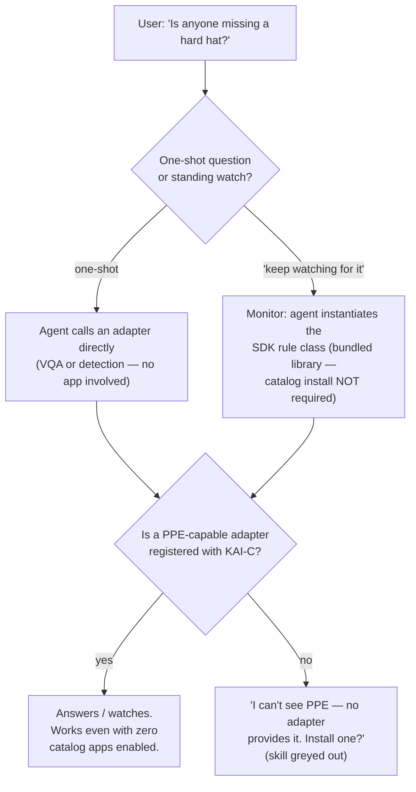

# Two Doors — every catalog app is automatically a conversational skill

> **Status.** The convergence described here lands with the agent's
> `create_monitor` instantiating SDK `Detector` classes at runtime
> (App SDK spec §07). This document is the community-facing
> explanation of *why* that matters: what you get for free when you
> write a rule once, and the capability-matching mechanism that makes
> the whole thing hang together.
>
> **New here?** Read the [examples gallery](../examples/README.md)
> first for what the apps *are*, and
> [`AI_ADAPTER_CONTRACT.md`](./AI_ADAPTER_CONTRACT.md) §4 for the
> `/capabilities` shape this document leans on.

---

## 0. TL;DR — what every reader gets in one screen

You write one rule — "person in zone longer than N seconds", "more
than 3 cars in the driveway", "hard hat missing" — as an SDK
`Detector` class. That single class is reachable through **two front
doors**: the **App Catalog** (an operator enables it from a card,
fills in an auto-generated config form, and it runs as a 24/7
daemon) and the **camera agent** (a user *says* "keep watching the
driveway and tell me if more than 3 cars show up", and the agent
spins up the same class as a session monitor). Zero agent code on
your side. Whether either door can actually *do* the thing is decided
by one mechanism: intersecting the tasks your rule declares it needs
(`requires_tasks` in the app manifest) with the tasks registered
adapters advertise (`tasks_advertised` from `GET /capabilities`).

## 1. One rule library, two front doors

Before the convergence, the same rules existed twice: the standalone
examples (`loitering-detection`, `occupancy-counting`,
`line-crossing`, …) each ran a bespoke loop, and the camera agent
shipped its own `monitor` primitives — notify, count, crossing — that
reimplemented the same logic, down to sharing ByteTrack. Two
implementations of "count people in a zone" is one too many.

The SDK collapses this. A rule is a `Detector` subclass
(`sdk/opennvr-app-sdk/opennvr_app_sdk/detector.py`): it subscribes to
the NATS inference stream, keeps its state machine, and fires alerts.
The two doors differ only in **who configures it and for how long**:

| | Front door A: catalog app | Front door B: agent monitor |
|---|---|---|
| Who configures | Operator, via the manifest-generated form | The conversation ("watch the driveway, alert if >3 cars") |
| Config source | `AppManifest.params` → catalog UI | Agent's `create_monitor` maps the request onto the same params |
| Lifetime | 24/7 daemon, survives restarts | Session monitor, spun up and torn down conversationally |
| Code you write | The `Detector` class + manifest | **Nothing extra** — same class, instantiated at runtime |

Write your rule once and it is simultaneously an installable app card
in Settings → App Catalog *and* a voice/chat skill the agent can
invoke. You never touch the agent's codebase.

## 2. How capability matching works

Model names are labels; **matching happens on tasks**. Every adapter
answers `GET /capabilities` with a `tasks_advertised` list
([contract §4](./AI_ADAPTER_CONTRACT.md#4-the-capabilities-shape)) —
a small, free-text vocabulary answering "I want any adapter that does
X". Three examples that make the semantics concrete:

- **yolov8** advertises `object_detection`. It can find people,
  vehicles, and bags; it cannot see hard hats or hi-vis vests, and —
  crucially — *it does not claim to*. The advertisement is honest by
  construction: an adapter lists only what its weights actually do.
- **A PPE adapter** is fine-tuned weights in the same ~30-line
  adapter shell ([contract §3.7](./AI_ADAPTER_CONTRACT.md)),
  advertising `ppe_detection`. Same contract, same endpoints,
  different task string.
- **A VLM like moondream** advertises `vqa` and answers arbitrary
  per-frame questions ("is this person wearing a hard hat?"). Slower
  per frame, but it needs no task-specific model at all.

On the consuming side, every SDK app declares `requires_tasks` in its
`AppManifest`
(`sdk/opennvr-app-sdk/opennvr_app_sdk/manifest.py`) — e.g.
`["object_detection"]` for occupancy counting, `["ppe_detection"]`
for a hard-hat rule.

That's the whole mechanism. The registry, the catalog, and the agent
all do the same thing: **intersect the lists.** `requires_tasks` is
checked against `GET /api/v1/adapters`; if the intersection is empty,
the capability isn't there. This is exactly what's behind the
catalog's "requires `ppe_detection` — not installed" badge: the card
still renders, but it's greyed out until an adapter advertising that
task registers with KAI-C. No hardcoded model lists anywhere — the
day a matching adapter appears, the badge flips on its own.

(Terminology guard, same as the contract: `tasks_advertised` says
what an adapter *can do*; `permissions` says what it *needs* from the
host. The two never interact — see contract §8.1.)

## 3. The decision flow

What actually happens when you ask the agent about something,
one-shot or standing:

Two things in this diagram are worth staring at:

1. **The monitor path does not require the catalog.** The rule
   library is bundled; the agent instantiates a `Detector` directly.
   The catalog is the *operator's* door, not a gate in front of the
   agent's.
2. **Both paths converge on the same capability check.** "Can I
   answer this?" and "can this app run?" are the same question,
   answered by the same task intersection. When the answer is no, the
   agent fails honestly and actionably — it names the missing task
   and suggests installing an adapter, mirroring the catalog's greyed
   badge.

## 4. What this means for you as a developer

Two contribution surfaces, each of which now pays out twice:

- **Publish an adapter** advertising a new task
  (`fall_detection`, `weapon_detection`, `ppe_detection`, …) and two
  things light up at once, with no coordination from you: every
  catalog app whose `requires_tasks` names that task loses its grey
  badge, *and* the agent can start answering questions and standing
  up watches that need it.
- **Publish an SDK app** — one `Detector` class plus a manifest —
  and it's a catalog card with an auto-generated config form, *and*
  (post-convergence) a standing conversational watch the agent can
  create on request.

You write the rule or the model shell. The platform provides both
doors.

---

*See also:* [`AI_ADAPTER_CONTRACT.md`](./AI_ADAPTER_CONTRACT.md) §4
(`tasks_advertised`) and §8 (permissions vs tasks) ·
[App SDK spec](./design/app-sdk-spec.html) §07 (the convergence) ·
[`examples/camera-agent/AGENT_DESIGN.md`](../examples/camera-agent/AGENT_DESIGN.md)
(why capabilities are tools).
