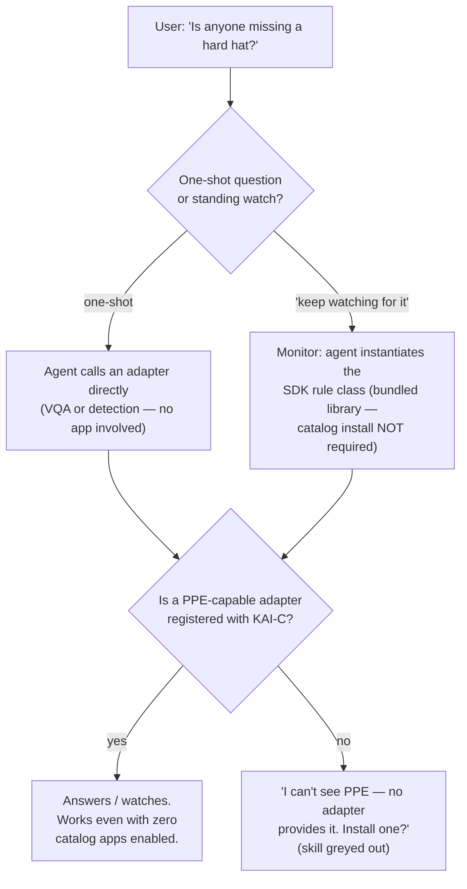

# Two Doors — every catalog app is automatically a conversational skill

> **Status.** The convergence described here lands with the agent's
> `create_monitor` instantiating SDK `Detector` classes at runtime
> (App SDK spec §07). This document is the community-facing
> explanation of *why* that matters: what you get for free when you
> write a rule once, and the capability-matching mechanism that makes
> the whole thing hang together.
>
> **New here?** Read the [examples gallery](../examples/README.md)
> first for what the apps *are*, and
> [`AI_ADAPTER_CONTRACT.md`](./AI_ADAPTER_CONTRACT.md) §4 for the
> `/capabilities` shape this document leans on.

---

## 0. TL;DR — what every reader gets in one screen

You write one rule — "person in zone longer than N seconds", "more
than 3 cars in the driveway", "hard hat missing" — as an SDK
`Detector` class. That single class is reachable through **two front
doors**: the **App Catalog** (an operator enables it from a card,
fills in an auto-generated config form, and it runs as a 24/7
daemon) and the **OpenNVR Agent**, formerly the Camera Agent (a user
*says* "keep watching the driveway and tell me if more than 3 cars
show up", and the agent spins up the same class as a session
monitor). Zero agent code on your side. Whether either door can actually *do* the thing is decided
by one mechanism: intersecting the tasks your rule declares it needs
(`requires_tasks` in the app manifest) with the tasks registered
adapters advertise (`tasks_advertised` from `GET /capabilities`).

## 1. One rule library, two front doors

Before the convergence, the same rules existed twice: the standalone
examples (`loitering-detection`, `occupancy-counting`,
`line-crossing`, …) each ran a bespoke loop, and the OpenNVR Agent
shipped its own `monitor` primitives — notify, count, crossing — that
reimplemented the same logic, down to sharing ByteTrack. Two
implementations of "count people in a zone" is one too many.

The SDK collapses this. A rule is a `Detector` subclass
(`sdk/opennvr-app-sdk/opennvr_app_sdk/detector.py`): it subscribes to
the NATS inference stream, keeps its state machine, and fires alerts.
The two doors differ only in **who configures it and for how long**:

| | Front door A: catalog app | Front door B: agent monitor |
|---|---|---|
| Who configures | Operator, via the manifest-generated form | The conversation ("watch the driveway, alert if >3 cars") |
| Config source | `AppManifest.params` → catalog UI | Agent's `create_monitor` maps the request onto the same params |
| Lifetime | 24/7 daemon, survives restarts | Session monitor, spun up and torn down conversationally |
| Code you write | The `Detector` class + manifest | **Nothing extra** — same class, instantiated at runtime |

Write your rule once and it is simultaneously an installable app card
in Settings → App Catalog *and* a voice/chat skill the agent can
invoke. You never touch the agent's codebase.

## 2. How capability matching works

Model names are labels; **matching happens on tasks**. Every adapter
answers `GET /capabilities` with a `tasks_advertised` list
([contract §4](./AI_ADAPTER_CONTRACT.md#4-the-capabilities-shape)) —
a small, free-text vocabulary answering "I want any adapter that does
X". Three examples that make the semantics concrete:

- **yolov8** advertises `object_detection`. It can find people,
  vehicles, and bags; it cannot see hard hats or hi-vis vests, and —
  crucially — *it does not claim to*. The advertisement is honest by
  construction: an adapter lists only what its weights actually do.
- **A PPE adapter** is fine-tuned weights in the same ~30-line
  adapter shell ([contract §3.7](./AI_ADAPTER_CONTRACT.md)),
  advertising `ppe_detection`. Same contract, same endpoints,
  different task string.
- **A VLM like moondream** advertises `vqa` and answers arbitrary
  per-frame questions ("is this person wearing a hard hat?"). Slower
  per frame, but it needs no task-specific model at all.

On the consuming side, every SDK app declares `requires_tasks` in its
`AppManifest`
(`sdk/opennvr-app-sdk/opennvr_app_sdk/manifest.py`) — e.g.
`["object_detection"]` for occupancy counting, `["ppe_detection"]`
for a hard-hat rule.

That's the whole mechanism. The registry, the catalog, and the agent
all do the same thing: **intersect the lists.** `requires_tasks` is
checked against the aggregated task set from
`GET /api/v1/ai-models/capabilities`; if the intersection is empty,
the capability isn't there. This is exactly what's behind the
catalog's "requires `ppe_detection` — not installed" badge: the card
still renders, but it's greyed out until an adapter advertising that
task registers with KAI-C. No hardcoded model lists anywhere — the
day a matching adapter appears, the badge flips on its own.

(Terminology guard, same as the contract: `tasks_advertised` says
what an adapter *can do*; `permissions` says what it *needs* from the
host. The two never interact — see contract §8.1.)

**Canonical tasks (curated + open).** Task strings stay free-text — you
can advertise anything and it matches — but once a task converges,
OpenNVR gives it a canonical name in
[`server/config/tasks.yml`](../server/config/tasks.yml)
([contract §4.1](./AI_ADAPTER_CONTRACT.md#41-the-canonical-task-taxonomy--curated--open)),
served over `GET /api/v1/ai-models/tasks`. Each entry carries a label, a skill
binding, and **aliases** — non-canonical spellings that mean the same
capability. That last part is what makes the intersection above robust:
we shipped one captioning adapter as `scene_caption` and another as
`image_captioning` — one capability, two names. Listing `scene_caption`
as an alias of `image_captioning` folds them into one, so both spellings
satisfy the agent's `see` skill and the catalog counts them as the same
task. A short lint (`lint_task_names`) nudges adapters toward the
canonical spelling, but nothing is ever blocked — a brand-new task string
still registers and works, just uncategorized until it's promoted into
`tasks.yml`.

**The greyed-skill → install-adapter on-ramp.** Each entry can also name
`suggested_adapters` — the reference adapter(s) that provide the task
(editorial, mirroring `use_case_map.yml`). When a skill greys out because
no live adapter advertises a backing task, the agent doesn't just say "no":
its skills panel names the suggested adapter(s) (e.g. *"needs an adapter
advertising object_detection — suggested: YOLOv8"*) and, when the agent is
configured with the main UI's base URL (`opennvr_ui_url`), renders an
**"Enable →"** link straight to the **AI Adapters** view. That link is
navigation only — the agent **guides** the operator to the right screen; it
never enables or approves an adapter itself. Enabling stays an operator
action behind OpenNVR's permission gate.

## 3. The decision flow

What actually happens when you ask the agent about something,
one-shot or standing:

Two things in this diagram are worth staring at:

1. **The monitor path does not require the catalog.** The rule
   library is bundled; the agent instantiates a `Detector` directly.
   The catalog is the *operator's* door, not a gate in front of the
   agent's.
2. **Both paths converge on the same capability check.** "Can I
   answer this?" and "can this app run?" are the same question,
   answered by the same task intersection. When the answer is no, the
   agent fails honestly and actionably — it names the missing task
   and suggests installing an adapter, mirroring the catalog's greyed
   badge.

## 3a. The app door — container apps as read-only conversational skills

The convergence above covers rules the agent can *instantiate* itself: the
bundled `Detector` library. But a catalog app is often a **container app** —
its own process, registered with the server (`POST /api/v1/apps/register`),
that the agent can't import and run in-session. The occupancy counter you
enabled from a card, a third-party PPE app, an LPR pipeline: these are
already running as 24/7 daemons. The agent shouldn't reimplement them — it
should be able to *talk about* them.

That's the **app door**: when the agent is configured with the OpenNVR
server's base URL (`opennvr_api_url`), it discovers every installed catalog
app and can relay its state conversationally. Three read-only tools back it:

- **`list_apps`** — the installed **and enabled** apps: id, name, summary,
  category, and what each emits (alert types). "What apps are running? Do I
  have a loitering detector?"
- **`app_status`** — one app's live health + state, proxied through the
  server's `GET /api/v1/apps/{id}/status`. "Is the occupancy app healthy?
  What's it seeing right now?"
- **`recent_app_alerts`** — the alerts installed apps have *fired*, off the
  bus (the alert relay, below). "Any alerts from my apps? Did the PPE app
  flag anything in the last hour?" Optional `app_id` + `window_seconds`
  filters; returns newest-first.

Each installed+enabled app also surfaces in the agent's skills panel as a
`source:"app"` entry (`id` like `app:loitering-detection`), alongside the
generic **`apps`** capability skill — so "every catalog app is a
conversational skill" holds for container apps too, not just the bundled
rule library.

**The read-only boundary is the whole point.** The app door is strictly
*read/relay*: the agent surfaces what's installed and reports live state, and
that is **all** it can do. There is deliberately no enable / disable /
configure tool, no handler, and no client method — enabling an app, editing
its config, or registering one stays an **operator action** in the app
catalog, behind OpenNVR's permission gate. The agent **guides** ("you have a
loitering detector installed but disabled — enable it from the app catalog");
it never flips the switch. This mirrors the greyed-skill on-ramp in §2: the
agent names the action and points at the operator's screen, but the operator
acts.

On the server, this is one thin seam: `GET /api/v1/apps` and
`GET /apps/{id}/status` accept the deployment's `X-Internal-Api-Key` (a
read-only service principal, constant-time compared) as an alternative to a
user JWT, exactly like `POST /apps/register` already does — while
enable/disable/config **remain user-JWT-only**. The agent's registry client
is cached (60s TTL, negative-cached) and never raises: an unreachable or
unconfigured registry degrades to a graceful "couldn't reach the app
registry" message and simply omits the per-app skill entries, never a crash.

**Alert relay — the app door's second half (shipped).** Discovery + state
query is the *pull* side. The *push* side is the agent **subscribing** to app
alerts on the bus (`opennvr.alerts.app.>` — the §11.5 alert envelope apps
publish via the App SDK) so a container app firing a loitering or PPE alert
reaches the user through the same conversational surface as the agent's own
watches. This surfaces two ways:

- **Conversationally** — the `recent_app_alerts` tool answers "any alerts
  from my apps?" out of a bounded, newest-first in-memory ring (the same
  shape as the `recent_events` inference ring, with a monotonic sequence
  tiebreak so an equal-timestamp burst stays deterministically ordered).
- **Proactively** — each incoming alert is pushed into the **same
  notification feed** the demo polls and the **same webhook fan-out**
  (`Notifier`) the agent's own watches and alarms use, labelled
  `source: "app:<id>"`. So "the PPE app flagged a violation" reaches you
  even with the tab closed, exactly like a watch notification.

The subscriber rides the **same NATS connection** the inference-event
subscriber uses (`nats_inference_url`); it starts only when NATS is
configured and, like the event subscriber, **never crashes the agent** —
a down broker or a missing `nats-py` degrades to an empty ring, not an
error. Non-alert / malformed bus traffic is dropped by the parser.

**Still strictly read/relay.** The agent *consumes and reports* app alerts —
the `recent_app_alerts` query tool plus the proactive notification surfacing.
There is deliberately **no** path that arms, silences, acknowledges, enables,
or reconfigures an app: no such tool, handler, or client method exists.
Arming or silencing an app stays an **operator action**, exactly like the
enable/disable/configure boundary above. The agent relays the alert; it never
acts on the app.

## 4. What this means for you as a developer

Two contribution surfaces, each of which now pays out twice:

- **Publish an adapter** advertising a new task
  (`fall_detection`, `weapon_detection`, `ppe_detection`, …) and two
  things light up at once, with no coordination from you: every
  catalog app whose `requires_tasks` names that task loses its grey
  badge, *and* the agent can start answering questions and standing
  up watches that need it.
- **Publish an SDK app** — one `Detector` class plus a manifest —
  and it's a catalog card with an auto-generated config form, *and*
  (post-convergence) a standing conversational watch the agent can
  create on request.

You write the rule or the model shell. The platform provides both
doors.

---

*See also:* [`AI_ADAPTER_CONTRACT.md`](./AI_ADAPTER_CONTRACT.md) §4
(`tasks_advertised`) and §8 (permissions vs tasks) ·
[App SDK spec](./design/app-sdk-spec.html) §07 (the convergence) ·
[`examples/camera-agent/AGENT_DESIGN.md`](../examples/camera-agent/AGENT_DESIGN.md)
(why capabilities are tools).
