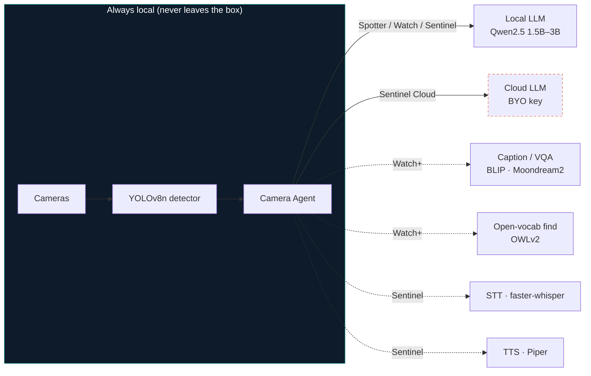

<!--
Copyright (c) 2026 OpenNVR
SPDX-License-Identifier: AGPL-3.0-or-later
-->

# OpenNVR Camera Agent — Editions & Models

This is the product decision for how the camera-agent ships: a small set of
clearly-named **editions** that trade footprint against capability, each with a
**deliberately efficient model stack**, so a newcomer can be talking to their
cameras in a minute *and* a security-conscious operator can run the whole thing
air-gapped. One stack can't be both "tiny and instant" and "sovereign and
complete," so we stop pretending it can and name the trade instead.

The business position is unchanged and stated up front: **the fully-local,
sovereign Sentinel edition is the flagship and the moat.** No-vendor-egress,
runs-on-your-own-iron, NDAA-clean is what nobody else in the consumer/SMB space
credibly offers. The lighter editions are not a retreat from that — they are the
*on-ramp* to it. The reason the project sees few stars and forks is that today
the only door in is the 12 GB, ten-container, voice-first door. Spotter and
Sentinel Cloud add doors; they don't move the house.

## The four editions

| Edition | What it does | Footprint | Brain | Sovereignty | Profile / config |
|---------|--------------|-----------|-------|-------------|------------------|
| **Spotter** (Lite) | Text chat over your cameras: see / count / recent events / standing monitors / alarms | **~1–2 GB**, 1 vision model | small local LLM **or** cloud | `local_only` capable | `camera-agent-lite` · `config.lite.yml` |
| **Watch** (Standard) | Spotter **+ scene description & visual Q&A + open-vocabulary "find the red truck"** | ~3–4 GB | small/mid local LLM | `local_only` capable | `camera-agent-standard` · `config.standard.yml` |
| **Sentinel** (Full / Voice) | Watch **+ hands-free voice, avatar, named persona (Shailaja / Sidhu)** — the full agent | ~6–8 GB* | mid local LLM | **`local_only` — the flagship** | `camera-agent` · `config.docker.yml` |
| **Sentinel Cloud** (Hybrid) | Local vision, **cloud brain** (and optionally cloud voice). Best reliability, near-zero local RAM | ~1–2 GB | cloud LLM (BYO key) | **Not sovereign — explicit opt-in** | `config.cloud.yml` |

\* ~6–8 GB once the voice adapters run as **one combined container** instead of
three (see *Container topology*, below). Today it is ~10–12 GB.

The first-run **default is Spotter**. That single choice is the adoption fix: it
turns "only the maintainer can run this" into "anyone can try it in a minute,"
and every heavier edition is one flag away.

Frames never leave the machine in any edition. In Sentinel Cloud, only the
*chat/tool-call text* goes to the chosen provider — which is why it is labelled
non-sovereign and gated behind an explicit operator opt-in, with the boot-time
audit entry the security model already emits when the posture is relaxed.

## The model stack — chosen for efficiency, not size

The rule is **don't build models — orchestrate the best small existing ones**,
and weight every choice by CPU latency because that *is* the user experience.

| Job | Pick (default) | Why this one | Cost |
|-----|----------------|--------------|------|
| **Object detection** | **YOLOv8n** (ONNX) | The workhorse — counts people/cars/etc. Tiny, fast, runs everywhere | ~6 MB · ~20–40 ms/frame CPU |
| Detection (accuracy opt) | YOLO11m | When nano misses small/distant objects | ~40 MB |
| **Open-vocab find** | **OWLv2-base** (existing `vlm` adapter) | "Find the red truck / a person on a bicycle" — no retraining, query in plain text | ~600 MB |
| **Scene description / VQA** | **BLIP-base** now → **Moondream2** next | BLIP captions today; Moondream2 (~1.8B) adds real *visual Q&A* ("is the gate open?") at edge size — a feature unlock, not just a caption | BLIP ~990 MB · Moondream2 ~1.7 GB |
| **Speech-to-text** | **faster-whisper `base.en`** (CTranslate2) | ~4× faster than vanilla Whisper on CPU at equal accuracy; English-only avoids foreign-token hallucination | ~140 MB · near-real-time |
| **Text-to-speech** | **Piper** (`en_US-libritts-high`, `-low` for snappier first audio) | Already the most efficient quality TTS for local; sub-second synthesis | ~60 MB |
| **Brain — snappy** | **Qwen2.5-1.5B-Instruct** | Smallest model that still tool-calls reliably; the Spotter default | ~1.5 GB · ~10–20 tok/s CPU |
| **Brain — reliable** | **Qwen2.5-3B-Instruct** | Markedly better multi-tool prompts; the Watch/Sentinel default | ~3 GB |
| **Brain — cloud** | gpt-4o-mini · Groq Llama-3.3-70B · Claude Haiku | Best tool-call reliability, ~0 local RAM, lowest latency | BYO key |
| **Faces / watchlist** | **InsightFace `buffalo_s`** | Small face pack is plenty for enroll + watchlist match; half the RAM of `buffalo_l` | ~0.3 GB |

Two honest trade-offs worth stating in the docs: small CPU LLMs *will*
occasionally miss a tool call on a tool-heavy prompt — mitigated by the
anti-fabrication forced-grounding guard (shipped) and constrained tool-call
decoding (next) — and snappy-on-CPU vs reliably-agentic is a real dial you set
per machine, which is exactly what the editions encode.

### Exciting features these unlock
The point of picking *capable* small models (not just *small* ones) is that each
adds a feature, not just a footprint line: **visual Q&A** ("is the driveway gate
open?") from Moondream2, **open-vocabulary search** ("tell me if a red truck
shows up") from OWLv2, **hands-free voice with a named persona** from
faster-whisper + Piper, and **reliable standing monitors & alarms** from
Qwen2.5's tool-calling. None of these requires training anything.

## Run on the hardware you already have — zero camera provisioning

You shouldn't have to wire up an RTSP camera just to try this. If the machine
the agent runs on *has* a camera, it uses it: set `auto_discover_cameras: true`
(see `config.local.yml`) and the agent finds the local capture device — a
**laptop webcam** for a dev, a **USB or Pi camera**, or the onboard camera on a
**drone / robot** (`/dev/video*`). Frame URLs gain a `device:` scheme
(`device:0`, `device:/dev/video1`, `device:auto`) alongside the existing
`http(s)://`, `rtsp://`, and `file://` sources, so *any* device that exposes a
camera or a stream can run its own on-board sovereign agent.

This is the lightweight end of the hardware dial taken to its logical end: the
camera-agent isn't only something you point *at* cameras — it can be the app
that *ships on* the camera-bearing device itself. (Local device capture needs
OpenCV on the host; it's imported lazily so nothing else depends on it.)

## Container topology — the other half of "too heavy"

Running the full agent today starts ~10 containers, and three of them —
`whisper-adapter`, `piper-adapter`, `blip-adapter` — run as separate images. To
be accurate about where the weight actually is: **whisper** uses faster-whisper
(CTranslate2, *no* torch) and **piper** uses piper-tts + onnxruntime (*no*
torch); only **`blip-adapter` carries a full PyTorch + Transformers stack**
(~2 GB of torch plus its ~990 MB baked weights). So the cost isn't "torch ×3" —
it's three separate containers to pull, start, and health-check, one of which
(BLIP) is genuinely heavy on its own.

The fix: a **combined "voice adapter" image** that runs all three adapter apps
(`adapters.whisper/piper/blip.main`) in **one container** on their existing
ports. This is a true contract match — same per-adapter `/infer` endpoints the
camera-agent already calls — so it's low-risk, unlike the monolithic
`app/main.py` (port 9100, task-routed) which is a *different* contract. What it
buys, honestly:

- **One image instead of three; one container instead of three.** Fewer things
  to pull, start, and restart — the real, immediate win.
- **Modest RAM savings** (one Python base, shared libs), but be honest: the RAM
  of the full edition is dominated by the *models* — the Ollama LLM (2–6 GB) and
  BLIP+torch (~3 GB) — not by container overhead. **Merging containers does not
  halve RAM.**
- **The big RAM lever is the editions and model choices, not the merge.** Spotter
  and Watch don't start the voice adapters at all; a smaller LLM and
  faster-whisper `tiny.en` cut the most. That's where "~12 GB → ~6–8 GB" actually
  comes from.

Needs a real `docker build` + a live bring-up to verify (can't build in-sandbox),
so the combined service ships as an opt-in profile, not a silent default swap.
Modularity stays correct for production scale-out (independent GPU placement,
swap-a-model, fault isolation), so the per-adapter images remain the advanced
option.

## Honest RAM accounting (why "~12 GB → ~6–8 GB")

The full edition's memory is the *models*, not container overhead. The defaults
now favour the light end (override per box via `.env`):

| Component | Old default | New default | Resident RAM |
|-----------|-------------|-------------|--------------|
| LLM (Ollama, kept warm) | `llama3.2:3b` | **`qwen2.5:1.5b`** | ~3.5 GB → **~1.5–2 GB** |
| STT (Whisper) | `base.en` | **`tiny.en`** | ~1 GB → **~0.3–0.5 GB** |
| Captions (BLIP + torch) | on | on (full only) | ~2.5–3 GB |
| TTS (Piper) | on | on (full only) | ~0.1 GB |
| Detector (YOLOv8n) + core | on | on | ~1–1.5 GB |

So a default **full** edition lands around **~6–8 GB** instead of ~11–12 GB,
and **Spotter/Watch** (no Whisper/Piper/BLIP) sit at ~1–4 GB. The single var
`OLLAMA_MODEL` drives both the model pull and the agent config, and
`WHISPER_MODEL_SIZE` swaps the STT model — bump them to `qwen2.5:3b` / `base.en`
for more reliable tool-calling and transcription when you have the headroom.

This is the real RAM lever (the combined-image merge above is operational
simplicity, not memory). Be honest in conversation about the trade: a 1.5B model
on CPU is snappy but will occasionally miss a tool call on a busy prompt — the
forced-grounding guard catches the worst of it, and the cloud/`qwen2.5:3b` tiers
are there when reliability matters more than footprint.

## How this maps to the issue #82 complaints

Heavy stack / ~12 GB RAM → **Spotter & Watch** make the light path real and the
default, and the heavy hitters are the LLM + BLIP, so a smaller LLM and dropping
BLIP where it isn't needed is the lever. Container/image sprawl → **combined
voice adapter** (3 images → 1; staged behind a profile). Sovereignty blocking dev → **Sentinel Cloud** is the
labelled, audited escape hatch; `local_only` stays the secure default. Small-LLM
unreliability → **Qwen2.5 picks + cloud brain tier**. Cloud comparison →
**Sentinel Cloud** is the apples-to-apples profile, with the sovereign Sentinel
still the differentiator nobody else offers.

The local sovereign stack stays the *promise*; the editions are the *doors* that
let people actually walk up to it.
